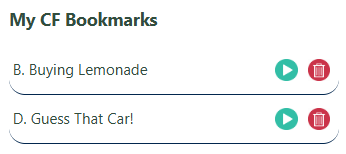

# CF_chrome_extension

A lightweight Chrome Extension that lets you **bookmark individual Codeforces problems**, view them in a popup, and easily revisit or remove them — all synced across devices.

---

## 🚀 Features

- 🖼️ Adds a **custom bookmark icon** (not the default Codeforces star) to each problem page.
- 📥 Save the problem's name and URL to Chrome sync storage.
- 📋 View all saved problems in the popup interface.
- 🔗 Open problems in new tabs directly from the popup.
- 🗑️ Delete saved problems anytime.

---

## 📁 Project Structure


---

## 🧑‍🏭 Installation

1. Clone or download this repo to your computer.
2. Open **Chrome** and navigate to `chrome://extensions/`.
3. Enable **Developer Mode** (toggle in top-right).
4. Click **“Load unpacked”** and select the folder where this extension is stored.
5. Visit any [Codeforces problem](https://codeforces.com/problemset/problem/1900/B) and click the ⭐ icon to bookmark it!

---

## 🛠 How It Works

### 📍 On Problem Pages

- Detects if you're on a valid problem page (e.g., `/contest/<id>/problem/<index>` or `/problemset/problem/<id>/<index>`).
- Adds a small **bookmark icon** next to the problem title.
- Clicking it extracts:
  - The problem name (from `.title`)
  - A unique problem ID (`contestId + index`)
  - The current page URL
- Saves the problem data to `chrome.storage.sync`.

### 🪟 Popup Interface

- Access the popup by clicking the extension icon in your browser toolbar.
- Shows all your bookmarked Codeforces problems in a clean, card-style layout.
- Each entry displays:
  - 📄 Problem title
  - ▶️ Green circular **play** button — opens the problem in a new tab
  - 🗑️ Red circular **delete** button — removes the bookmark

#### 🔎 Preview



---

## 🌐 Permissions Used

```json
"permissions": ["storage", "tabs"]
